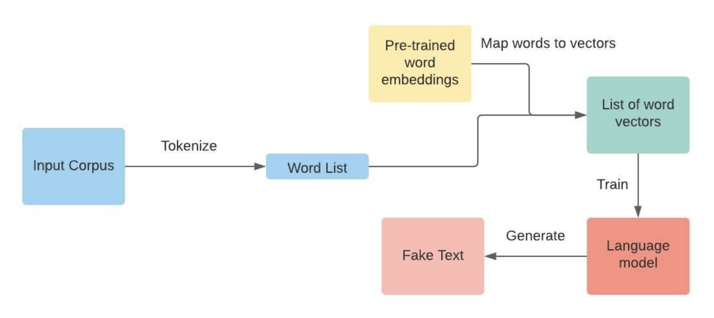

## CSE583: Natural Language Processing
#### Zhan Shi, Neilly Herrera Tan, Angel Burr

Component flowchart:

Here, the pipeline is broken down into three main parts: Preprocessing, Training, and Decoding. Generally, the program takes an input corpus ``input`` (any .txt file), and generates a word list ``output``. Here, the input is passed into a vectorizer that maps the words onto vectors during the Preprocessing stage. Then, the input will train the language model (Training), and decode this model (Decoding) to generate a fake text output.

**Novel packages used:**
* MxNet, an easy to use and customizable deep learning package.
* Gensim for the pretrained word embeddings.
* NLTK for preprocessing text files.

### Use case: Generating fake text
Below, we describe interactions with the different software components based on our main use case of generating fake text. 

#### Preprocessing
First, the user will input their input corpus. Using NLTK, we preprocess the input text with 4 main functions in mind:
1. Tokenize the input.
2. Indexing
3. Generate ``EndOfSentence`` tokens
4. Break token list into pieces based on ``EOS`` tokens for batch training

#### Training
Then, we train the language model with the input given, containing two parts:
1. Initializing the embedding matrix with pre-trained vectors (using gensim) when available, otherwise start at random.
2. Training the LSTM model

#### Decoding
Lastly,  we decode the language model with pytorch to generate the fake text output. This uses both the greedy method and top k random sampling method.